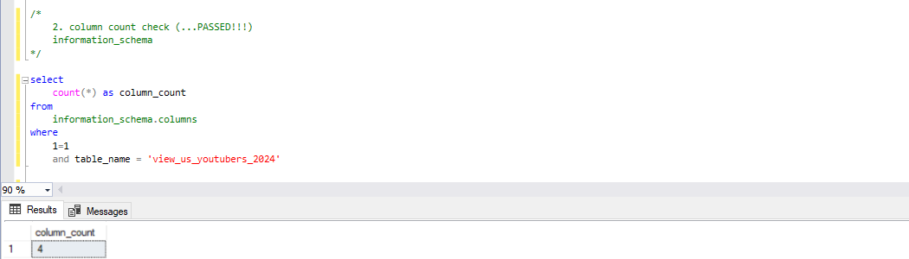
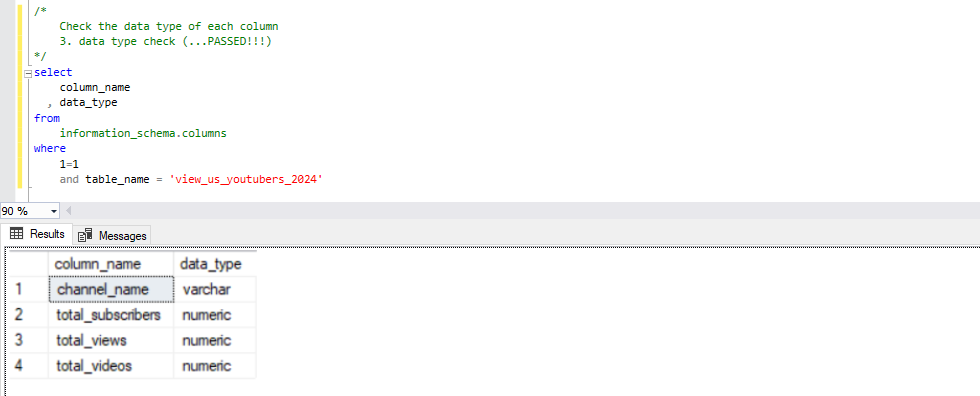
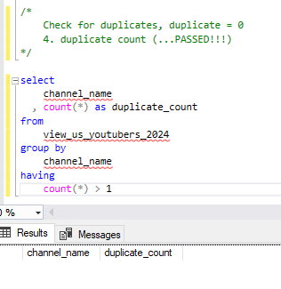
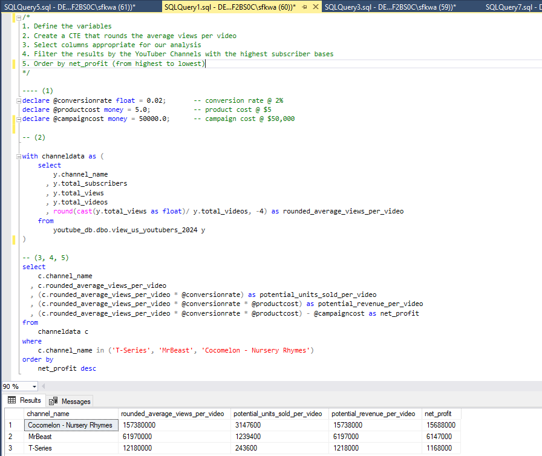
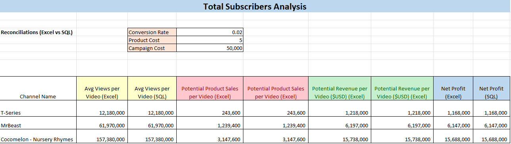

# Data Portfolio Project : Top USA YouTubers 2024 


# Table of Contents


- [Business Case](#business-case)
- [Objective](#objective)
  - [Challenges](#challenges)
  - [Target Audience](#target-audience)
- [User Story](#user-story)
  - [Acceptance Criteria](#acceptance-criteria)
  - [Success Criteria](#success-criteria)
- [Data Source](#data-source)
  - [Data Quality Checks](#data-quality-checks)
- [Stages](#stages)
- [Design](#design)
  - [Dashboard Components](#dashboard-components)
  - [Dashboard Mockup](#dashboard-mockup)
  - [Tools](#tools)
- [Development](#development)
  - [Initial Data Exploration](#initial-data-exploration)
  - [Data Cleaning](#data-cleaning)
  - [Data Cleaning Steps](#data-cleaning-steps)
- [Data Testing](#data-testing)
- [Visualization](#visualization)
  - [Power BI Dashboard](#power-bi-dashboard)
  - [DAX Measures](#dax-measures)
- [Analysis](#analysis)


# Business Case

Sharon works for a social media agency and is the head of marketing. She wants to run successful marketing campaigns with successful YouTubers from the USA. She has a budget approved by the board so she wants to be certain where to channel the budget towards.

# Objective

The Head of Marketing wants to find out who the top YouTubers are in 2024 to decide on which YouTubers would be best to run marketing campaigns throughout the rest of the year.


- How will we help Sharon run successful and profitable marketing campaigns?


We will utilize 2024 YouTube data to create a dashboard and draw insights from the dashboard. This data will include : 

- Subscriber Count 
- Total Views
- Total Videos, and
- Engagement Metrics

We will analyze this information to provide informed recommendations on which YouTuber to collaborate with to Sharon and the marketing team.

### Challenges

Trying to find successful youtubers she can work with, but : 

- Struggled to find the right information on the internet, there are inconsistencies with whom she should work with
- 3rd party providers are out of budget, and
- BI reporting team does not have the bandwidth to assist Sharon with the assignment

Solution : 

Create a simple dashboard that displays the top USA Youtubers by : 

- Subscribers
- Video uploads
- Views 

With the information above, she can make a more insightful decision on who to collaborate with.

### Target Audience 

Who are we aiming to support?

- Primary : Sharon (Head of Marketing)
- Secondary - Marketing Team Members (who are involved with this campaign)

# User Story 

As the head of marketing, I want to identify the top YouTubers in the USA based on subscriber count, videos uploaded and views accumulated, so that I can decide on which channels would be best to run marketing campaigns with to generate a good ROI.
Also, I want to analyze the potential for successful campaigns with the top Youtubers so that I can maximize the ROI.


### Acceptance Criteria

The dashboard should : 

- List the top Youtube Channels by subscribers, videos, and views
- Display key metrics (channel name, subscribers, videos, views, engagement ratio)
- Be user-friendly and easy to filter/ sort
- Use the most recent data possible

The solution should : 

- Recommend Youtube channels best suited for different campaign types (e.g. product placement, sponsored video series, influencer marketing)
- Consider reach, engagement and potential revenue based on estimated conversion rates
- Clearly explain the recommendations with data-driven justifications 

### Success Criteria 

Sharon can : 

- Easily identify the top performing Youtube channels based on the key metrics mentioned above
- Assess the potential for successful campaigns with top Youtubers based on reach, engagement and potential revenue
- Make informed decisions based on the ideal collaborations to advance with based on recommendations

This allows Sharon to achieve a good ROI and build relationships with Youtubers for future collaborations, which leads to recognition within the company.


# Data Source 

- What data is needed to achieve our objective?

We need top USA YouTuber 2024 data which include : 

- Channel name 
- Total subscribers 
- Total videos uploaded 
- Total views 
- Average views per video
- Subscriber engagement ratio
- Views per subscriber

### Data Quality Checks

We need to add measures in place to confirm the dataset contains the data required without any issues - here are some of the data quality checks we need to conduct : 

- Row count check
- Column count check
- Data type check
- Duplicate check


# Stages

- Design
- Development
- Testing
- Analysis
- Recommendations

  
# Design

### Dashboard Components

What questions are we trying to answer with this dashboard? 

1. Who are the top 10 YouTubers with most subscribers?
2. Who are the top 10 YouTubers with the most viewership?
3. Which 3 channels uploaded the most videos?
4. Which 3 channels have the highest average views per video?
5. Which 3 channels have the highest views per subscriber ratio?
6. Which 3 channels have the highest subscriber engagement rate per video uploaded?

### Dashboard Mockup

What will this dashboard look like? What visuals will we be including? 

1. Data Table
2. Treemap
3. Scorecards
4. Horizontal Bar Chart

### Tools 

| Tool | Purpose |
| --- | --- |
| Excel | Exploring the data |
| SQL Server | Cleaning, testing, and analyzing the data |
| Power BI | Visualizing the data via interactive dashboards |
| GitHub | Hosting the project documentation and version control |
| Mokkup AI | Designing the wireframe/mockup of the dashboard | 


# Development 

Stages of development : 

1. Collect top YouTuber data
2. Explore data on Excel
3. Import data into SQL Server Management Studio
4. Clean the data w/ SQL
5. Test the data w/ SQL
6. Create a view w/ SQL
7. Import view into Power BI for visualiztion
8. Create DAX measures and Power BI Dashboard
9. Create an analysis workbook
10. Generate findings based on insights
11. Provide recommendations to stakeholder
12. Publish the data to GitHub Pages


### Initial Data Exploration

Initial Observations : 

1. There are 4 columns we will need : channel_name, total_subscribers, total_views, and total_videos. We will filter for these 4 columns during the SQL cleaning phase.
2. The channel_name column includes the channel name followed by an @ and the channel id, so we will need to extract the channel name from this string.
3. We will need to check for any null values during the data cleaning process. 


### Data Cleaning

What should the clean data look like? 

We are aiming to refine our dataset to include only relevant infomration for accurate analysis. 

The clean data should be the following constraints : 

- channel_name, total_subscribers, total_views, and total_videos columns
- Ensure all data types are appropriate
- No null values, complete dataset
- No unknown character values
- Provide appropriate alias, or rename

  
Below is a table outlining the constraints on our cleaned dataset:

| Property | Description |
| --- | --- |
| Number of Rows | 100 |
| Number of Columns | 4 |

And here is a tabular representation of the expected schema for the clean data:

| Column Name | Data Type | Nullable |
| --- | --- | --- |
| channel_name | VARCHAR | NO |
| total_subscribers | INTEGER | NO |
| total_views | INTEGER | NO |
| total_videos | INTEGER | NO |


### Data Cleaning Steps

1. Remove the unnecessary columns by only selecting the ones we need
2. Extract the YouTube channel name from channel_name column
3. Rename columns using aliases


#### Transform the data 


```sql
/*
Goal :
  1. select all columns that are necessary and leave out ones that are not
  2. extract channel names from name column
  3. rename name column to show channel_name

*/

select
    cast(substring(u.name, 1, charindex('@', u.name) - 1) as varchar(100)) as channel_name
  , u.total_subscribers
  , u.total_views
  , u.total_videos
from
    us_top_youtubers_2024 u

```

#### Create the SQL view


```sql
/*
Goal : 
	1. create view to store cleaned and transformed data
*/

create view view_us_top_youtubers_2024 as (

		select
                    cast(substring(u.name, 1, charindex('@', u.name) - 1) as varchar(100)) as channel_name
		  , u.total_subscribers
		  , u.total_views
		  , u.total_videos
		from
                    us_top_youtubers_2024 u
)

```

# Data Testing

What are we testing for? 

High Quality Data Set - data that is complete and accurate, not missing records or inaccurate data, so we need to make sure our stakeholders can make accurate decisions based on this data.
In order to make sure this is true, we need to run different tests. 

Data quality tests : 

1. Row count check
2. Column count check
3. Data type check
4. Duplicate check

Expectations : 

1. Row count = 100
2. Column count = 4
3. Data Types :
    - channel_name = VARCHAR
    - total_subscribers = integer or numerical
    - total_views = integer or numerical
    - total_videos = integer or numerical
4. Duplicate count = 0


#### Row count check


```sql
/*
    Count the total number of rows 
    1. row count check (...PASSED!!!)
*/
select
    count(*) as row_count
from	
    view_us_youtubers_2024 u

```


#### Column count check


```sql
/*
    2. column count check (...PASSED!!!)
    information_schema
*/

select
    count(*) as column_count
from	
    information_schema.columns
where
    1=1
    and table_name = 'view_us_youtubers_2024'

```




#### Data type check


```sql
/*
    Check the data type of each column
    3. data type check (...PASSED!!!)
*/
select
    column_name
  , data_type
from	
    information_schema.columns
where
    1=1
    and table_name = 'view_us_youtubers_2024'

```




#### Duplicate check


```sql
/*
    Check for duplicates, duplicate = 0
    4. duplicate count (...PASSED!!!)
*/

select
    channel_name
  , count(*) as duplicate_count
from	
    view_us_youtubers_2024
group by
    channel_name
having 
    count(*) > 1

```




# Visualization

### Power BI Dashboard 


### DAX Measures

#### 1. Total Subscribers (M)
```sql
Total Subscribers (M) = 
VAR million = 1000000
VAR sumffsubscribers = sum(view_uk_youtubers_2024[total_subscribers])
VAR totalsubscribers = divide(sumffsubscribers, million)

RETURN totalsubscribers

```

#### 2. Total Views (B)
```sql
Total Views (B) = 
VAR billion = 1000000000
VAR sumoftotalviews = sum(view_uk_youtubers_2024[total_views])
VAR totalviews = round(sumoftotalviews/ billion, 2)

RETURN totalviews

```

#### 3. Total Videos
```sql
Total Videos = 
VAR totalvideos = sum(view_uk_youtubers_2024[total_videos])

RETURN totalvideos

```

#### 4. Average Views Per Video (M)
```sql
Average Views per Video (M) = 
VAR sumoftotalviews = sum(view_uk_youtubers_2024[total_views])
VAR sumoftotalvideos = sum(view_uk_youtubers_2024[total_videos])
VAR  avgviewspervideo = divide(sumoftotalviews, sumoftotalvideos, BLANK())
VAR finalavgviewspervideo = divide(avgviewspervideo, 1000000, BLANK())

RETURN finalavgviewspervideo

```


#### 5. Subscriber Engagement Rate
```sql
Subscriber Engagement Rate = 
VAR sumoftotalsubscribers = sum(view_uk_youtubers_2024[total_subscribers])
VAR sumoftotalvideos = sum(view_uk_youtubers_2024[total_videos])
VAR subscriberengrate = divide(sumoftotalsubscribers, sumoftotalvideos, BLANK())

RETURN subscriberengrate

```


#### 6. Views per subscriber
```sql
Views Per Subscriber = 
VAR sumoftotalviews = sum(view_uk_youtubers_2024[total_views])
VAR sumoftotalsubscribers = sum(view_uk_youtubers_2024[total_subscribers])
VAR viewspersubscriber = divide(sumoftotalviews, sumoftotalsubscribers, BLANK())

RETURN viewspersubscriber

```


# Analysis

### Findings

For this analysis, we will be focusing on the questions below : 

Here are the questions we need to answer for our marketing client : 

1. Who are the top 10 YouTubers with most subscribers?
2. Who are the top 10 YouTubers with the most viewership?
3. Which 3 channels uploaded the most videos?
4. Which 3 channels have the highest average views per video?
5. Which 3 channels have the highest views per subscriber ratio?
6. Which 3 channels have the highest subscriber engagement rate per video uploaded?

#### 1. Who are the top 10 YouTubers with most subscribers?

| Rank | Channel Name                | Subscribers (M) |
|------|-----------------------------|-----------------|
| 1    | T-series                    | 265.00          |
| 2    | MrBeast                     | 260.00          |
| 3    | Cocomelon - Nursery Rhymes  | 175.00          |
| 4    | SET India                   | 172.00          |
| 5    | Kids Diana Show             | 122.00          |
| 6    | Vlad and Niki               | 118.00          |
| 7    | Like Nastya                 | 115.00          |
| 8    | PewDiePie                   | 111.00          |
| 9    | Zee Music Company           | 107.00          |
| 10   | WWE                         | 101.00          |


#### 2. Who are the top 10 YouTubers with the most viewership?

| Rank | Channel Name                 | Total Views (B) |
|------|------------------------------|-----------------|
| 1    | T-series                     | 255.64          |
| 2    | Cocomelon - Nursery Rhymes   | 182.88          |
| 3    | SET India                    | 163.88          |
| 4    | Sony SAB                     | 114.52          |
| 5    | Kids Diana Show              | 103.04          |
| 6    | Like Nastya                  | 100.39          |
| 7    | Vlad and Niki                | 90.26           |
| 8    | Zee TV                       | 89.16           |
| 9    | WWE                          | 84.53           |
| 10    | Colors TV                   | 70.47           |


#### 3. Which 3 channels uploaded the most videos?

| Rank | Channel Name             | Videos Uploaded |
|------|--------------------------|-----------------|
| 1    | ABP NEWS                 | 375,160.00      |
| 2    | Aaj Tak                  | 360,870.00      |
| 3    | ABS-CBN Entertainment    | 223,974.00      |


#### 4. Which 3 channels have the highest average views per video?

| Channel Name        | Averge Views per Video (M) |
|---------------------|----------------------------|
| Bad Bunny           | 225.88                     |
| Bruno Mars          | 210.29                     |
| Katy Perry          | 186.84                     |


```sql
select
    u.name
  , round(cast(u.total_views as float)/ u.total_videos, 2) as avg_views_per_vid
from
    youtube_db.dbo.us_top_youtubers_2024 u
order by
    avg_views_per_vid desc

```

#### 5. Which 3 channels have the highest views per subscriber ratio?

| Rank | Channel Name                      | Views per Subscriber        |
|------|---------------------------------  |---------------------------- |
| 1    | Ryan's World                      | 1556.14                     |
| 2    | Sony SAB                          | 1244.76                     |
| 3    | Super Simple Songs - Kids Songs   | 1209.12                     |


```sql
select
    u.name
  , round(cast(u.total_views as float)/ u.total_subscribers, 2) as views_per_sub
from
    youtube_db.dbo.us_top_youtubers_2024 u
order by
    views_per_sub desc

```

#### 6. Which 3 channels have the highest subscriber engagement rate per video uploaded?

| Rank | Channel Name      | Views per Subscriber        |
|------|------------------ |---------------------------- |
| 1    | Billie Eilish     | 429,661.02                  |
| 2    | Bruno Mars        | 380,000.00                  |
| 3    | EminemMusic       | 368,518.52                  |


```sql
select
    u.name
  , round(cast(u.total_subscribers as float)/ u.total_videos, 2) as eng_rate
from
    youtube_db.dbo.us_top_youtubers_2024 u
order by
    eng_rate desc

```

#### Notes 

For this analysis, we prioritized analyzing metrics that directly impacted the return on investment (ROI) for this marketing campaign. The analysis we will do include : 

- Total subscriber analysis
- Total video count analysis
- Total views analysis


### Validation

#### 1. Top Subscriber Analysis

##### Calculation Breakdown

Campaign Type : Product Placement
Product Cost : $5.00
Conversion Rate : 0.02 or 2%
Campaign Cost : $50,000 (one-time fee)

a. T-series
- Average Views per Video = 12,180,000.00
- Potential Product Sales per Video = Average Views per Video * Conversion Rate = 12,180,000.00 * 0.02 = 243,600 units sold
- Potential Revenue per Video = Potential Product Sales per Video * Product Cost = 243,600 * $5.00 = $1,218,000
- **Net Profit = Potential Revenue per Video - Campaign Cost = $1,218,000 - $50,000 = $1,168,000**

b. MrBeast 
- Average Views per Video = 61,970,000.00
- Potential Product Sales per Video = Average Views per Video * Conversion Rate = 61,970,000.00 * 0.02 = 1,239,400 units sold
- Potential Revenue per Video = Potential Product Sales per Video * Product Cost = 1,239,400 * $5.00 = $6,197,000
- **Net Profit = Potential Revenue per Video - Campaign Cost = $6,197,000 - $50,000 = $6,147,000**

c. Cocomelon - Nursery Rhymes
- Average Views per Video = 157,380,000.00
- Potential Product Sales per Video = Average Views per Video * Conversion Rate = 157,380,000.00 * 0.02 = 3,147,600 units sold
- Potential Revenue per Video = Potential Product Sales per Video * Product Cost = 3,147,600 * $5.00 = $15,738,000
- **Net Profit = Potential Revenue per Video - Campaign Cost = $15,738,000 - $50,000 = $15,688,000**

**Highest ROI : Cocomelon - Nursery Rhymes @ $15,688,000 net profit**

#### SQL query

```sql
/*
1. Define the variables
2. Create a CTE that rounds the average views per video
3. Select columns appropriate for our analysis
4. Filter the results by the YouTuber Channels with the highest subscriber bases
5. Order by net_profit (from highest to lowest)
*/

---- (1)
declare @conversionrate float = 0.02;		-- conversion rate @ 2%
declare @productcost money = 5.0;	        -- product cost @ $5
declare @campaigncost money = 50000.0;          -- campaign cost @ $50,000

-- (2)
with channeldata as (
	select
            y.channel_name
	  , y.total_subscribers
	  , y.total_views
	  , y.total_videos 
	  , round(cast(y.total_views as float)/ y.total_videos, -4) as rounded_average_views_per_video
	from	
            youtube_db.dbo.view_us_youtubers_2024 y
)

-- (3, 4, 5) 
select
    c.channel_name
  , c.rounded_average_views_per_video
  , (c.rounded_average_views_per_video * @conversionrate) as potential_units_sold_per_video
  , (c.rounded_average_views_per_video * @conversionrate * @productcost) as potential_revenue_per_video
  , (c.rounded_average_views_per_video * @conversionrate * @productcost) - @campaigncost as net_profit
from
    channeldata c
where
    c.channel_name in ('T-Series', 'MrBeast', 'Cocomelon - Nursery Rhymes')
order by
    net_profit desc

```






#### 2. Top Video Count Analysis

##### Calculation Breakdown

Campaign Type : 11-video Series Sponsorship 
Product Cost : $5.00
Conversion Rate : 0.02 or 2%
Campaign Cost : $55,000 ($5k per video)

a. ABP NEWS
- Average Views per Video = 40,000.00
- Potential Product Sales per Video = Average Views per Video * Conversion Rate = 40,000.00 * 0.02 = 800 units sold
- Potential Revenue per Video = Potential Product Sales per Video * Product Cost = 800 * $5.00 = $4,000
- **Net Profit = Potential Revenue per Video - Campaign Cost = $4,000 - $55,000 = -$51,000**

b. Aaj Tak 
- Average Views per Video = 90,000.00
- Potential Product Sales per Video = Average Views per Video * Conversion Rate = 90,000.00 * 0.02 = 1,800 units sold
- Potential Revenue per Video = Potential Product Sales per Video * Product Cost = 1,800 * $5.00 = $9,000
- **Net Profit = Potential Revenue per Video - Campaign Cost = $9,000 - $55,000 = -$46,000**

c. ABS-CBN Entertainment
- Average Views per Video = 240,000.00
- Potential Product Sales per Video = Average Views per Video * Conversion Rate = 240,000.00 * 0.02 = 4,800 units sold
- Potential Revenue per Video = Potential Product Sales per Video * Product Cost = 4,800 * $5.00 = $24,000
- **Net Profit = Potential Revenue per Video - Campaign Cost = $24,000 - $55,000 = -$31,000**

**Highest ROI : ABS-CBN Entertainment @ -$31,000 (net loss)**

#### SQL query

```sql
/*
1. Define the variables 
2. Create a CTE that rounds the average views per video
3. Select columns appropriate for our analysis
4. Filter the results by the YouTuber Channels with the highest video count
5. Order by net_profit (from highest to lowest)
*/

-- (1)
declare @conversionrate float = 0.02;		-- conversion rate @ 2%
declare @productcost money = 5.0;		-- product cost @ $5
declare @campaigncost money = 55000.0;          -- campaign cost @ $55,000, 11 video series @$5k a video

-- (2)
with channeldata as (
	select
            y.channel_name
	  , y.total_subscribers
	  , y.total_views
	  , y.total_videos
	  , round(cast(y.total_views as float)/ y.total_videos, -4) as rounded_average_views_per_video
	from
            youtube_db.dbo.view_us_youtubers_2024 y
)

select
    c.channel_name
  , rounded_average_views_per_video
  , (rounded_average_views_per_video * @conversionrate) as potential_product_sales_per_vid
  , (rounded_average_views_per_video * @conversionrate * @productcost) as potential_rev_per_vid
  , (rounded_average_views_per_video * @conversionrate * @productcost) - @campaigncost as net_profit
from
    channeldata c
where
    c.channel_name in ('ABP NEWS', 'Aaj Tak', 'ABS-CBN Entertainment')
order by
    net_profit desc

```


#### 3. Top Views Analysis

##### Calculation Breakdown

Campaign Type : Influencer Marketing
Product Cost : $5.00
Conversion Rate : 0.02 or 2%
Campaign Cost : $130,000 (one-time fee)

a. T-series
- Average Views per Video = 12,180,000.00
- Potential Product Sales per Video = Average Views per Video * Conversion Rate = 12,180,000.00 * 0.02 = 243,600 units sold
- Potential Revenue per Video = Potential Product Sales per Video * Product Cost = 243,600 * $5.00 = $1,218,000
- **Net Profit = Potential Revenue per Video - Campaign Cost = $1,218,000 - $130,000 = $1,088,000**

b. Cocomelon - Nursery Rhymes
- Average Views per Video = 157,380,000.00
- Potential Product Sales per Video = Average Views per Video * Conversion Rate = 157,380,000.00 * 0.02 = 3,147,600 units sold
- Potential Revenue per Video = Potential Product Sales per Video * Product Cost = 3,147,600 * $5.00 = $15,738,000
- **Net Profit = Potential Revenue per Video - Campaign Cost = $15,738,000 - $130,000 = $15,608,000**

c. SET India
- Average Views per Video = 1,190,000.00
- Potential Product Sales per Video = Average Views per Video * Conversion Rate = 1,190,000.00 * 0.02 = 23,800 units sold
- Potential Revenue per Video = Potential Product Sales per Video * Product Cost = 23,800 * $5.00 = $119,000
- **Net Profit = Potential Revenue per Video - Campaign Cost = $119,000 - $130,000 = -$11,000**

**Highest ROI : Cocomelon - Nursery Rhymes @ $15,608,000 net profit**

#### SQL query

```sql
/*
1. Define the variables 
2. Create a CTE that rounds the average views per video
3. Select columns appropriate for our analysis
4. Filter the results by the YouTuber Channels with the greatest view count
5. Order by net_profit (from highest to lowest)
*/

-- (1)
declare @conversionrate float = 0.02;		-- conversion rate @ 2%
declare @productcost money = 5.0;		-- product cost @ $5
declare @campaigncost money = 130000.0;         -- campaign cost, Influencer Marketing

-- (2)
with channeldata as (
	select
            y.channel_name
	  , y.total_subscribers
	  , y.total_views
	  , y.total_videos
	  , round(cast(y.total_views as float)/ y.total_videos, -4) as rounded_average_views_per_video
	from
            youtube_db.dbo.view_us_youtubers_2024 y
)

select
    c.channel_name
  , rounded_average_views_per_video
  , (rounded_average_views_per_video * @conversionrate) as potential_product_sales_per_vid
  , (rounded_average_views_per_video * @conversionrate * @productcost) as potential_rev_per_vid
  , (rounded_average_views_per_video * @conversionrate * @productcost) - @campaigncost as net_profit
from
    channeldata c
where
    c.channel_name in ('T-series', 'Cocomelon - Nursery Rhymes', 'SET India')
order by
    net_profit desc

```


  


